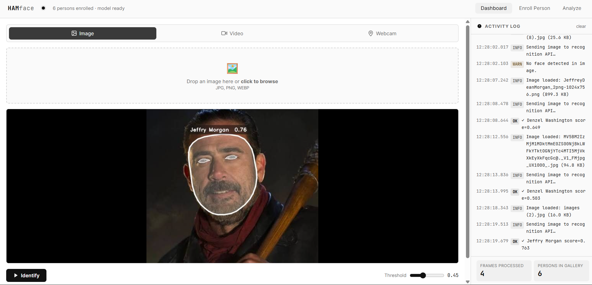

<div align="center">

# 🎭 HAMFace

### Hardness-Aware Margin Face Recognition System

[](https://www.python.org/)
[](https://pytorch.org/)
[](https://fastapi.tiangolo.com/)
[](https://developers.google.com/mediapipe)
[](LICENSE)

A two-stream deep learning face recognition system with adaptive angular margin loss, real-time WebSocket inference, and a full FastAPI web dashboard.



</div>

---

## ✨ Features

| Feature | Description |
|---|---|
| **Two-Stream Architecture** | EfficientNetB0 (local) + CvT (global) with Dynamic Attention Fusion |
| **HAMFace Loss** | Adaptive angular margin — larger margin for easy samples, smaller for hard ones |
| **Real-Time Detection** | Live webcam inference via WebSocket |
| **Multi-Face Support** | YOLO-based detection handles multiple faces per frame |
| **No Retraining** | Enroll new identities at runtime by updating the gallery only |
| **Rich Overlay** | Face oval polygon, eye contours, and name/score labels |
| **REST + WebSocket API** | Full FastAPI backend with 6 endpoints |
| **Adjustable Threshold** | Tune cosine similarity threshold per request |
| **GPU Support** | Automatically uses CUDA when available |

---

## 🏗️ Architecture

```
Input Frame
    │
    ▼
┌─────────────────────────────────────────────┐
│              Stage 1 — Detection             │
│   YOLO face detector → bounding boxes        │
└───────────────────┬─────────────────────────┘
                    │ crop per face
                    ▼
┌─────────────────────────────────────────────┐
│             Stage 2 — Alignment              │
│   MediaPipe Tasks API                        │
│   → landmarks, eye alignment, oval polygon   │
└───────────────────┬─────────────────────────┘
                    │ aligned crop (H×W×3)
          ┌─────────┴─────────┐
          ▼                   ▼
┌──────────────────┐ ┌──────────────────────┐
│   Local Stream   │ │   Global Stream      │
│  EfficientNetB0  │ │  CvT (3-stage)       │
│  + Channel Attn  │ │  ConvEmbedding ×3    │
│  + Spatial Attn  │ │  TransformerEncoder  │
│  DynAttnFusion   │ │  16×16 = 256 tokens  │
└────────┬─────────┘ └──────────┬───────────┘
         │   64-d projection    │
         └──────────┬───────────┘
                    ▼
         DynamicAttentionFusion
                    │
                    ▼
         Linear → L2 Norm → embedding (128-d)
                    │
                    ▼
         Cosine Similarity vs Gallery
                    │
                    ▼
              Identity + Score
```

### HAMFace Loss

Unlike fixed-margin ArcFace, HAMFace computes an **adaptive margin per sample**:

```
adaptive_margin = m + t × hardness × (1 - cos θ_yi)
```

Hard samples (where the decision boundary is tight) receive a **smaller** margin, preventing over-penalization. Easy samples get a **larger** margin to keep the embedding space well-structured.

---

## 📁 Project Structure

```
face_recognition/
├── app.py              # FastAPI dashboard & API routes
├── face_pipeline.py    # Embedding, matching, annotation, frame processing
├── face_detector.py    # YOLO face detection (stage 1)
├── face_model.py       # HAMFace model construction & weight loading
├── attention.py        # ChannelAttention, SpatialAttention, DynamicAttentionFusion
├── cvt.py              # Convolutional Vision Transformer (CvT)
├── loss.py             # HAMFaceLoss — adaptive angular margin
├── face_alignment.py   # MediaPipe Tasks API alignment (stage 2)
├── model_store.py      # Singleton model/gallery/label-map cache
├── database.py         # SQLite activity log
├── config.py           # Hyperparameters and paths
├── train.py            # Training loop
├── routers/
│   └── analyze.py      # /analyze router
└── templates/          # Jinja2 HTML templates
```

---

## 🚀 Installation

```bash
# 1. Clone the repo
git clone https://github.com/your-username/hamface.git
cd hamface

# 2. Create environment
python -m venv venv
source venv/bin/activate   # Windows: venv\Scripts\activate

# 3. Install dependencies
pip install torch torchvision --index-url https://download.pytorch.org/whl/cu118
pip install fastapi uvicorn opencv-python mediapipe ultralytics \
            scikit-learn numpy jinja2 python-multipart

# 4. Place your weights
#    config.py → MODEL_WEIGHTS_PATH, YOLO_WEIGHTS_PATH, CLASS_WEIGHTS_PATH

# 5. Run
uvicorn app:app --reload --host 0.0.0.0 --port 8000
```

Open `http://localhost:8000` in your browser.

---

## 🌐 API Reference

| Method | Endpoint | Description |
|---|---|---|
| `GET` | `/api/status` | Model status and gallery size |
| `POST` | `/api/recognize/image` | Recognize face(s) in an uploaded image |
| `POST` | `/api/recognize/video_frame` | Process a single video frame |
| `POST` | `/api/enroll/person` | Enroll or update a person in the gallery |
| `GET` | `/api/persons` | List all enrolled identities |
| `WS` | `/ws/webcam` | Real-time recognition stream |

### Example — Recognize Image

```bash
curl -X POST http://localhost:8000/api/recognize/image \
  -F "file=@photo.jpg" \
  -F "threshold=0.45"
```

```json
{
  "image_b64": "<annotated JPEG as base64>",
  "results": [
    { "name": "Jeffry Morgan", "score": 0.763, "bbox": [412, 180, 720, 560] }
  ],
  "timestamp": 1751445600.0
}
```

### Example — Enroll Person

```bash
curl -X POST http://localhost:8000/api/enroll/person \
  -F "name=Alice" \
  -F "files=@alice1.jpg" \
  -F "files=@alice2.jpg"
```

### WebSocket Frame Protocol

```json
// Client → Server
{ "type": "frame", "data": "<data-url>", "threshold": 0.45 }

// Server → Client
{ "type": "result", "image_b64": "...", "results": [...], "timestamp": 1234 }
```

---

## ⚙️ Configuration

Key parameters in `config.py`:

| Parameter | Default | Description |
|---|---|---|
| `IMAGE_SIZE` | `128` | Input resolution |
| `EMBED_DIM` | `128` | Embedding dimension |
| `N_CLASSES` | — | Number of training identities |
| `LOSS_SCALE` (s) | `64.0` | Logit scale factor |
| `LOSS_MARGIN` (m) | `0.5` | Base angular margin |
| `LOSS_HARDNESS` (t) | `0.2` | Hardness coefficient |
| `CA_REDUCTION_RATIO` | `8` | Channel attention bottleneck ratio |
| `CVT_EMBED_DIM` | `64` | CvT embedding dimension |
| `CVT_NUM_HEADS` | `4` | Transformer attention heads |
| `YOLO_CONF_THRESHOLD` | `0.4` | YOLO detection confidence |

---

## 🗄️ Gallery Management

The gallery is stored as two files:

| File | Contents |
|---|---|
| `gallery_avg.pkl` | `{label_int: mean_embedding_vector}` |
| `label_map.npy` | `{label_int: "name"}` |

Enrollment averages new embeddings with any existing ones for that person — **no retraining required**. The gallery is hot-reloaded into the singleton cache via `reload_gallery()` after each update.

---

## 🔧 Use Cases

- **Access Control** — Camera at building entry; recognizes enrolled staff in real time
- **Attendance Tracking** — Contactless replacement for card readers or fingerprint scanners
- **Mobile / Web Auth** — Integrate as a microservice via REST or WebSocket
- **Surveillance** — Identify persons of interest in CCTV feeds
- **Retail VIP Recognition** — Personalized service for enrolled customers

---

## 🗺️ Roadmap

- [ ] Vector database backend (Faiss / Qdrant) for large-scale galleries
- [ ] Async processing queue for concurrent requests
- [ ] Liveness detection (anti-spoofing)
- [ ] ONNX export for edge deployment
- [ ] Persian-language dashboard UI
- [ ] Continual fine-tuning on new enrollments

---

## 📄 License

MIT License — see [LICENSE](LICENSE) for details.
