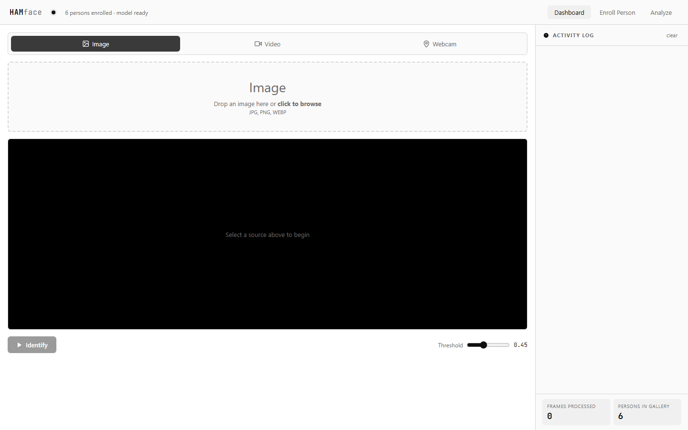

# HAMFace

HAMFace is a local face recognition and authentication dashboard built with FastAPI and PyTorch. It detects faces with a YOLO face model, aligns them with MediaPipe Face Landmarker, generates 128-dimensional embeddings with a two-stream HAMFace network, and matches those embeddings against a local gallery using cosine similarity.

The web interface supports still images, video files, live webcam recognition, identity enrollment, and session-based detection analytics stored in SQLite.



## Features

- Recognition from uploaded images, video frames, and a live webcam stream
- Multi-face detection and alignment before embedding extraction
- Configurable cosine-similarity acceptance threshold
- Enrollment of new identities without retraining the embedding model
- Persistent tracking sessions, detection history, summaries, and timelines
- Interactive OpenAPI documentation provided by FastAPI
- Lazy loading and process-wide caching for model and gallery assets

## Recognition pipeline

```text
Browser input
    -> YOLO face detection
    -> MediaPipe landmark alignment and face crop
    -> HAMFace InceptionResnetV1 and CvT embedding
    -> cosine-similarity gallery lookup
    -> annotated result and optional SQLite tracking record
```

## Requirements

- Python 3.10 or newer
- A webcam for live recognition, if that feature is used
- CUDA is optional; PyTorch uses it automatically when available and otherwise runs on CPU
- Model checkpoints and gallery files listed below

## Installation

Clone the repository and run all commands from its root directory:

```bash
git clone https://github.com/dariushmmz/HAMFace.git
cd HAMFace
python -m venv .venv
```

Activate the virtual environment:

```bash
# Windows PowerShell
.venv\Scripts\Activate.ps1

# Linux or macOS
source .venv/bin/activate
```

Install the dependencies:

```bash
python -m pip install --upgrade pip
python -m pip install -r requirements.txt
```

## Required assets

Large model, gallery, and biometric data files are intentionally excluded from Git. Place them at the following paths before using recognition:

```text
checkpoints/
|-- best_model.pt
|-- hamface_class_weights.npy
|-- yolov12n-face.pt
`-- face_landmarker.task

.dataset/processed/
|-- gallery_avg.pkl
`-- label_map.npy
```

The checkpoint class count must match `N_CLASSES` in `config.py`. The label map is stored on disk as a `name -> integer label` dictionary, while the average gallery maps integer labels to embedding vectors.

This repository does not include the training or gallery-generation pipeline. You must supply compatible assets produced by the HAMFace training workflow. New identities can then be added through the enrollment page without retraining.

## Running the application

Start the development server from the repository root:

```bash
uvicorn app:app --reload --host 127.0.0.1 --port 8000
```

Open the following URLs:

- Dashboard: `http://127.0.0.1:8000`
- Enrollment: `http://127.0.0.1:8000/enroll`
- OpenAPI documentation: `http://127.0.0.1:8000/docs`

Browser camera access is available on localhost. If the dashboard is hosted remotely, serve it over HTTPS for webcam access.

## Usage

### Image recognition

Open the dashboard, select the Image source, choose an image, adjust the threshold if needed, and select Identify. The response contains an annotated image and one result for every aligned face.

### Video recognition

Select the Video source and choose a local video. The browser extracts frames and submits them to the recognition API at the configured interval.

### Webcam recognition

Select Webcam, grant camera permission, and start the camera. JPEG frames are sent over a WebSocket and the server returns annotated frames and recognition results.

### Enrollment

Open `/enroll`, enter an identity name, and submit one or more clear face images. Successfully aligned images are embedded and merged into the local average gallery. Enrollment updates `.dataset/processed/gallery_avg.pkl` and `.dataset/processed/label_map.npy` in place.

### Analytics

Open the Analyze view from the dashboard navigation to create tracking sessions, record recognition events, inspect per-person summaries, view a detection timeline, and delete previous sessions. Analytics data is stored in `hamface_tracker.db`.

## API overview

| Method | Endpoint | Purpose |
| --- | --- | --- |
| `GET` | `/api/status` | Report gallery size, enrolled names, and required-asset readiness |
| `GET` | `/api/persons` | List enrolled identities and gallery membership |
| `POST` | `/api/recognize/image` | Recognize faces in an uploaded image |
| `POST` | `/api/recognize/video_frame` | Recognize faces in one uploaded video frame |
| `POST` | `/api/enroll/person` | Add or extend an identity using uploaded images |
| `WS` | `/ws/webcam` | Process live webcam frames |
| `POST` | `/api/analyze/sessions` | Create a tracking session |
| `GET` | `/api/analyze/sessions` | List tracking sessions |
| `GET` | `/api/analyze/sessions/{session_id}` | Read one tracking session |
| `PATCH` | `/api/analyze/sessions/{session_id}/end` | End a tracking session |
| `DELETE` | `/api/analyze/sessions/{session_id}` | Delete a tracking session and its detections |
| `POST` | `/api/analyze/image` | Recognize an image and persist its detections |
| `WS` | `/api/analyze/ws/track` | Run tracked live recognition |
| `GET` | `/api/analyze/sessions/{session_id}/detections` | List detections for a session |
| `GET` | `/api/analyze/sessions/{session_id}/summary` | Read session summary and timeline data |
| `GET` | `/api/analyze/stats` | Read aggregate tracking statistics |
| `GET` | `/api/analyze/persons/summary` | Read aggregate per-person statistics |

For complete request and response schemas, use the generated documentation at `/docs`.

## Configuration

Runtime paths and recognition parameters are defined in `config.py`. The most relevant settings are:

| Setting | Default | Description |
| --- | --- | --- |
| `IMAGE_SIZE` | `128` | Model input width and height |
| `EMBED_DIM` | `128` | Embedding vector size |
| `N_CLASSES` | `5` | Number of identities used to train the checkpoint |
| `YOLO_CONF_THRESHOLD` | `0.3` | Minimum face-detector confidence |
| Recognition threshold | `0.45` | Default cosine-similarity acceptance threshold in the API and UI |

Do not treat the default recognition threshold as universally calibrated. Evaluate it against representative data for the intended deployment.

## Project structure

```text
.
|-- app.py                 FastAPI application and primary routes
|-- config.py              Paths and model configuration
|-- database.py            SQLite session and detection storage
|-- face_alignment.py      MediaPipe alignment and face extraction
|-- face_detector.py       YOLO face detection
|-- face_pipeline.py       Preprocessing, embedding, matching, and annotation
|-- model_store.py         Lazy model and gallery cache
|-- person_store.py        Enrollment support
|-- models/                HAMFace, CvT, attention, and loss modules
|-- routers/analyze.py     Tracking and analytics API
|-- templates/             Dashboard and enrollment pages
`-- requirements.txt       Python runtime dependencies
```

## Validation

A basic local verification can be run with:

```bash
python -m compileall -q .
python -c "import app; print(app.app.title)"
```

Recognition requires all checkpoint and gallery assets. The landing page, enrollment page, status endpoint, analytics endpoint, and OpenAPI schema can be smoke-tested independently with FastAPI's test client.

## Security and privacy

HAMFace processes biometric data and does not provide authentication, authorization, rate limiting, or encrypted storage. Keep it on a trusted network unless those controls are added. Obtain appropriate consent before collecting face images, restrict access to checkpoint, gallery, dataset, and SQLite files, and define a retention policy suitable for your use case.

## License

No license file is currently included. Unless a license is added, the repository remains under the copyright holder's default rights.
